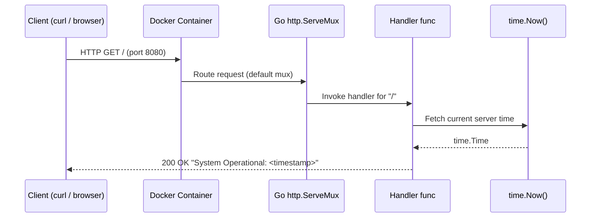
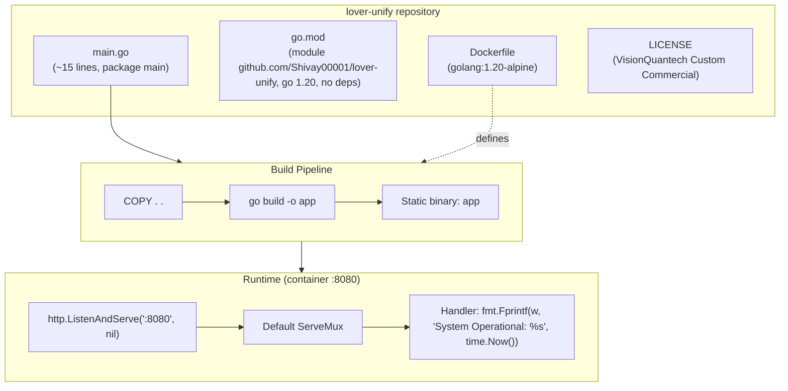
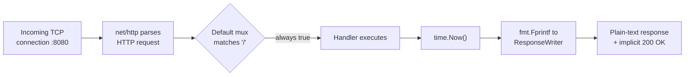

# lover-unify


> **A minimal, zero-dependency Go 1.20 HTTP microservice — containerized with Docker, reporting liveness and server time on port `8080`.**

---

## 🚀 Overview

**lover-unify** is a deliberately minimal Go microservice built entirely on the standard library. It exposes a single HTTP endpoint on port `8080` that responds with a plain-text operational status message containing the server's current timestamp. The repository consists of exactly one source file (`main.go`), a `Dockerfile` based on `golang:1.20-alpine`, and a `go.mod` with **zero external dependencies**.

This makes it an ideal:

- 🩺 **Liveness / health-check service**
- 🧱 **Skeleton foundation** for a larger Go microservice
- 📦 **Reference implementation** of a containerized Go deployment

## ✨ Features

| Feature | Detail |
|---|---|
| ⚡ Zero dependencies | Only `net/http`, `fmt`, `time`, `log` from the Go stdlib |
| 🐳 Docker-ready | Working `Dockerfile` (Go 1.20 Alpine base) |
| 🚀 Instant startup | Single static binary with sub-second boot |
| 🕐 Timestamped response | Confirms both service availability and clock state |
| 🔌 Single endpoint | Catch-all handler on `/` responding to every path |

## 🏗️ Architecture — How It Works

The entire application logic lives in `main.go` (~15 lines). Here is the exact execution flow derived from the code:

1. **Handler registration** — `http.HandleFunc("/", ...)` registers one catch-all handler on Go's default `http.ServeMux`. Because `/` is the root pattern, **every request to any path** receives the same response.
2. **Response generation** — the handler calls `fmt.Fprintf(w, "System Operational: %s", time.Now())`, writing the server's current local timestamp directly into the `http.ResponseWriter`.
3. **Startup logging** — `log.Println("Starting high-performance service on :8080")` announces boot to stdout.
4. **Blocking serve** — `http.ListenAndServe(":8080", nil)` binds to port `8080` and serves forever. On bind failure, `log.Fatal` prints the error and exits the process with a non-zero code.
5. **Containerization** — the `Dockerfile` copies the source into `golang:1.20-alpine`, compiles with `go build -o app`, and sets the binary as the container's `CMD`. Since `go.mod` has no `require` directives, the build performs **no network module fetches**.

### 🔄 Request Flow



### 🧩 Component Structure



### 📊 Response Lifecycle



## 🐳 Running with Docker

### Option 1 — Docker CLI (recommended)

```bash
# 1. Clone the repository
git clone https://github.com/Shivay00001/lover-unify.git
cd lover-unify

# 2. Build the image
docker build -t shivay00001/lover-unify .

# 3. Run the container (host:container port mapping)
docker run -d -p 8080:8080 --name lover-unify shivay00001/lover-unify

# 4. Verify
curl http://localhost:8080/
# → System Operational: 2026-01-01 12:00:00.000000000 +0000 UTC ...
```

### Option 2 — Docker Compose

No `docker-compose.yml` ships with the repo, but this minimal file works out of the box:

```yaml
version: "3.8"
services:
  app:
    build: .
    ports:
      - "8080:8080"
    restart: unless-stopped
```

Then:

```bash
docker-compose up -d --build
```

### 🛑 Stopping & cleanup

```bash
docker stop lover-unify && docker rm lover-unify
# or, with Compose:
docker-compose down
```

## 🛠️ Running Locally (no Docker)

Requires **Go 1.20+**:

```bash
go build -o app .
./app
# or simply:
go run main.go
```


## 📋 Workability Assessment

**Honest verdict: functional, but not production-ready.**

**✅ What works:**
- The code compiles and runs correctly as written.
- The Dockerfile is valid and produces a working container.
- The service responds as expected on port `8080` with zero external dependencies.

**⚠️ What needs work before production:**
- **Trivial functionality** — it is a skeleton, not a complete application.
- **No graceful shutdown** — no `os/signal` handling or `http.Server.Shutdown`; in-flight requests are dropped on termination.
- **No timeouts** — default `http.ListenAndServe` is vulnerable to Slowloris-style attacks; `ReadTimeout`/`WriteTimeout` should be set on an explicit `http.Server`.
- **Catch-all routing** — every path returns the same response; no `/healthz`, no routing, no 404 handling.
- **No tests / no CI** — zero test coverage and no linting pipeline.
- **Non-optimized Dockerfile** — single-stage build ships the full Go toolchain (~300MB+); a multi-stage build with a `scratch`/`alpine` final stage would shrink this to a few MB. The container also runs as root.
- **No configuration** — port `8080` is hardcoded; no environment variable support.

**Summary:** A clean, deployable Go microservice template — but it requires hardening (timeouts, graceful shutdown, non-root user, multi-stage build) and real business logic before production use.

## 📄 License

Distributed under the **VisionQuantech Custom Commercial License** — see [LICENSE](LICENSE) for full terms.

- 🆓 **Free** for personal, educational, and non-earning use.
- 💰 **Revenue share (15–30%)** required for individual/indie commercial earning use.
- 🏢 **Separate commercial license required** for business/enterprise use — contact: **visionquantech@proton.me**

---

*Copyright © 2026 Shivay00001 / VisionQuantech*